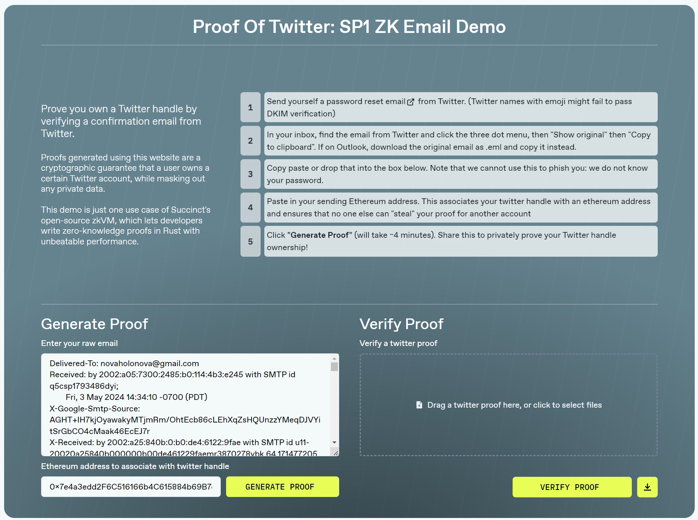

# Proof of Twitter: SP1

Prove ownership of a X (Twitter) account using an email from Twitter. Built on the SP1 zkVM from [Succinct](https://succinct.xyz/).

## How it works

You can use a Password Reset email from Twitter to generate a ZK proof that you own the Twitter acocunt `@username`. Verifying other types emails are possible with SP1 - the password reset email was chosen because of it's simplicity and lack of user generated content.

## Running Locally
#### Prerequisites

- [`node.js`](https://nodejs.org/en)
- [`yarn`](https://yarnpkg.com/getting-started/install)
- [`rust`](https://www.rust-lang.org/)
   -    after installing, switch to the `nightly` channel: `rustup default nightly`
- [`sp1`](https://succinctlabs.github.io/sp1/getting-started/install.html)
- a `c` linker for compiling rust. not sure? run `sudo apt-get update && sudo apt install build-essential`
- `libssl-dev`: `sudo apt-get install libssl-dev`
- `pkg-config`: `sudo apt-get install pkg-config`

#### Getting Started
1. Clone and open repo
2. Run `./start.sh`
3. Open the frontend by going to http://localhost:5173/ in your browser
   
If you're running this on a remote server, you may have to forward ports `5173` (frontend) and `8000` (backend) when ssh'ing in.
- `ssh -L 5173:localhost:5173 -L 8000:localhost:8000 username@host_ip_address`

#### Reccomended Specs

64GB+ of ram

#### Supported Platforms

Linux

## Future Prospects

This project is a scrappy proof-of-concept to demonstrate what is possible with ZKPs. Under the hood, there are plenty of optimizations that could make proof generation even faster:

- **RSA Precompile:** Currently, email signatures are verified manually with rust's `rsa` libray. Succinct has a precompile system of popular functions such as `sha256`, `ed25519`, and more. Precompiles speed up excecution by orders of magnitude. A RSA precompile would make proofs of email signatures far more efficient.
- **Regex pre-indexing:** The Regex queries search the entire email for labels such as the twitter handle and email sender (x.com). The indices of these labels could be pre-computed and passed into the program, saving many compute cycles that were just spent on searching.

## Examples

To try examples, paste contents of .eml file into app

<strong>Base Case</strong>

- A valid password reset email from Twitter
- <strong>Result:</strong> Generates valid proof that passes verification
- [Base Case.eml](https://github.com/xavierdmello/proof-of-twitter-sp1/blob/main/examples/Base%20Case.eml)

<strong>Non-Twitter</strong>

- A valid email not from Twitter 
- Fails at email sender check inside zkproof
- <strong>Result:</strong> Generates proof that fails verification\
- [Non Twitter.eml](https://github.com/xavierdmello/proof-of-twitter-sp1/blob/main/examples/Non%20Twitter.eml)

<strong>Invalid Signature</strong>

- Same email as Base Case except first character of signature is changed from D to E
- Fails while verifying RSA signature inside zkproof  
- <strong>Result:</strong> Generates proof that fails verification
- [Invalid Signature.eml](https://github.com/xavierdmello/proof-of-twitter-sp1/blob/main/examples/Invalid%20Signature.eml)

<strong>Not PW Reset Email</strong>

- A valid email from twitter that's not about password resetting
- Fails at email type check inside zkproof
- <strong>Result:</strong> Generates proof that fails verification
- [Not PW Reset Email.eml](https://github.com/xavierdmello/proof-of-twitter-sp1/blob/main/examples/Not%20PW%20Reset%20Email.eml)

